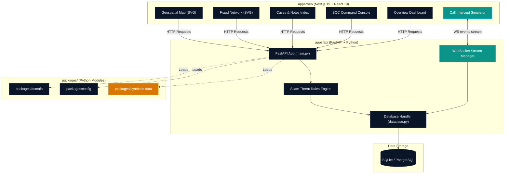

# Kavach AI Architecture Specification

Kavach AI is designed as a modular, containerized digital public safety intelligence platform. The first vertical slice focuses on real-time scam call interception, threat verdict generation, and automated financial locks.

## System Block Diagram

## Real-Time Event Flow

1. **Incoming VoIP Connection**: A citizen call is simulation-started on the Call Simulator frontend.
2. **Audio Transcription Segment**: The audio stream is chunked. Segments are pushed to the backend WebSocket stream `/api/v1/sessions/{id}/stream`.
3. **Risk Scoring Engine**: The backend evaluates segments against `ThreatIndicator` regex definitions (e.g. Identity Impersonation patterns).
4. **Scam Verdict Generation**: A `ThreatVerdict` (SAFE, SUSPICIOUS, CRITICAL) is updated.
5. **Simulated Interventions**: If CRITICAL, the backend emits `BLOCK_UPI` instructions, blocks the suspect wallet, updates the incident case log, and informs the SOC Dashboard.
