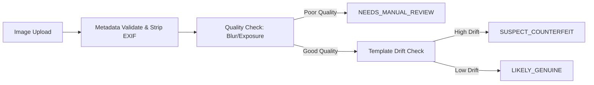

# Model Card: Note Scanner (Counterfeit Detection)

## Overview
- **Name:** Classical Note Scan Provider
- **Type:** Classical Computer Vision Heuristics (Pillow/Numpy)
- **Version:** 1.0.0 (Prototype)

## Intended Use
- **Primary Use Case:** Rapid, deterministic screening of submitted currency images for blur, exposure, and aspect ratio.
- **Out of Scope:** This is NOT a deep neural network and cannot detect high-fidelity micro-printing counterfeits.

## Pipeline Flow

## Performance & Limitations
- **Evaluation:** Evaluated against `counterfeit_dataset.json` synthetic perturbations.
- **Limitations:** Relies entirely on classical edge and channel statistics. Very susceptible to lighting variations, hence a conservative tuning towards `NEEDS_MANUAL_REVIEW`.
