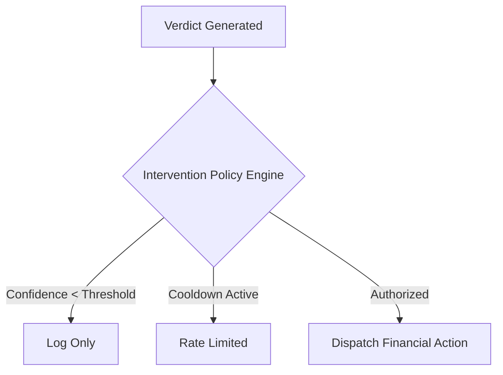

# Security Posture

Kavach AI is designed with strict security controls intended for deployment in isolated, offline-first command centers.

## 1. Threat Model & Injection Sanitization
- Adversarial transcripts (e.g., prompt injections) are scrubbed via the `ThreatModelProvider` before reaching the evaluation engine.

## 2. Audit & Non-Repudiation
- **Merkle-Chain Logs:** All state mutations (case updates, verdicts) are logged with a sequential SHA-256 hash pointing to the previous block. Any database tampering breaks the validation chain.

## 3. Intervention Policies

- Direct AI verdict generation is decoupled from financial action execution via a strict policy engine.

## 4. Role-Based Access
- Authorization headers (`X-Demo-Role`) simulate JWT parsing. Endpoints restrict `Citizen` from accessing `Analyst`, `Supervisor`, or `Admin` routes.
