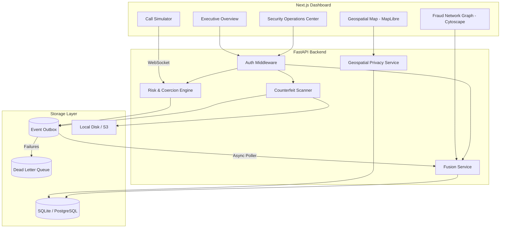

# Kavach AI System Design & Architecture

## Overview
Kavach AI is a Digital Public Safety Intelligence Hub designed to detect scam coercion in real-time, screen suspect currency, link fraud networks, and coordinate geospatial response. It operates through a decoupled architecture consisting of a Python backend (FastAPI, SQLAlchemy) and a React frontend (Next.js, MapLibre GL, Cytoscape.js).

## System Architecture Diagram

## Component Details

### 1. Risk & Coercion Engine
A rolling state machine that tracks behavioral coercion indicators rather than static keywords. It escalates sessions from `NORMAL` -> `CONCERN` -> `COERCION` -> `FINANCIAL_ACTION` based on severity accumulation.

### 2. Counterfeit Scanner
Uses classical computer vision techniques (Pillow/Numpy) to evaluate image quality (blur, exposure) and detect suspect features, routing border-line cases to manual review (`NEEDS_MANUAL_REVIEW`).

### 3. Geospatial Privacy Service
Ensures citizen privacy by aggregating incidents into K-anonymity hotspots or applying spatial jittering before coordinate data ever reaches the frontend dashboard.

### 4. Event Bus & Transactional Outbox
Provides guaranteed at-least-once delivery of internal domain events (e.g., `verdict_changed`). Events are committed to an Outbox table within the same transaction as the state change, ensuring consistency.

### 5. Merkle-Chain Audit Log
A tamper-evident audit trail for all critical interventions (e.g., session deletions, note additions). Each log entry stores the SHA-256 hash of the previous entry.
